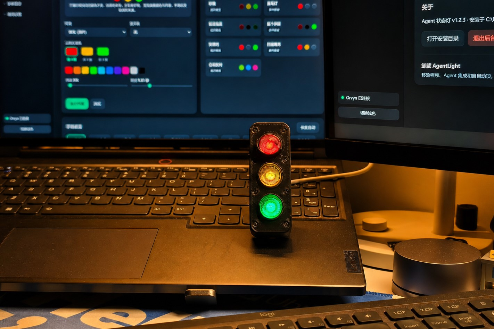
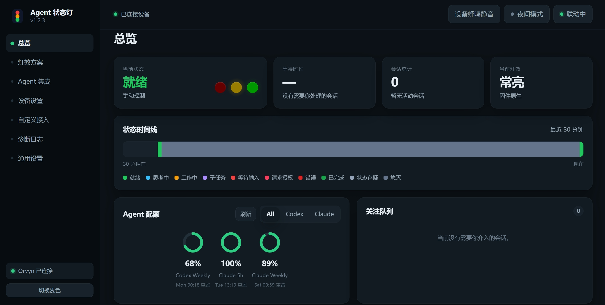
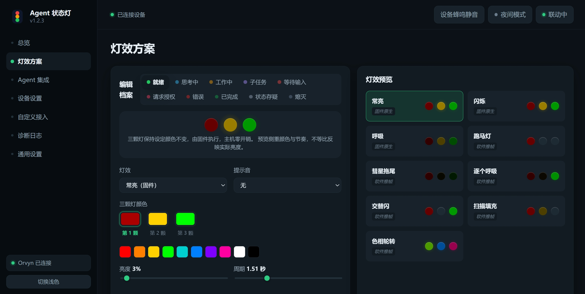
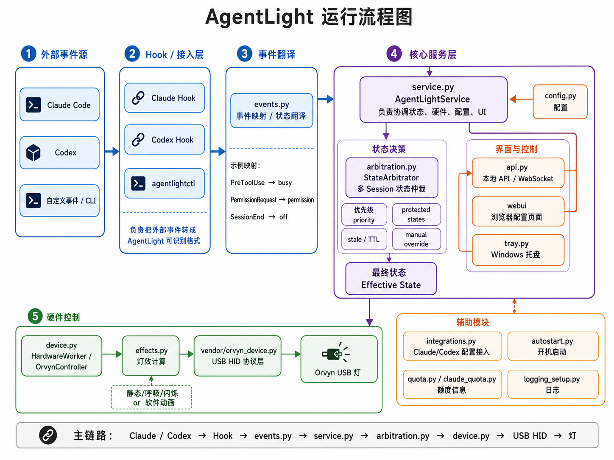

# AgentLight

A lightweight Windows companion that turns an **Orvyn RGB USB light** into a physical status indicator for AI coding agents.

AgentLight connects tools such as **Codex** and **Claude Code** to a USB RGB light, allowing agent activity and status changes to be reflected through colors and lighting effects in real time.



## Features

* Orvyn RGB USB light control
* Built-in integrations for Codex and Claude Code
* Configurable status colors, brightness, sound, and lighting effects
* Windows system tray controls
* Local browser-based settings interface
* Local CLI and API support for custom agent events
* Multi-session status handling and priority arbitration
* Codex and Claude usage quota display

## Interface

AgentLight provides a local dashboard for monitoring agent status, connected devices, active sessions, and usage information.



Lighting behavior can be customized for different agent states, including colors, brightness, timing, sound, and effects.



## Getting Started

1. Connect the **Orvyn RGB USB light** to your Windows PC.
2. Install and launch AgentLight.
3. Open **Agent Integrations** from the system tray.
4. Enable the Codex or Claude Code integration.
5. Restart the selected coding agent if required.
6. Customize status colors and lighting behavior from the local settings page.

Once configured, AgentLight listens for agent events and automatically updates the physical light to reflect the current state.

## How It Works

AgentLight receives events from supported coding agents through hooks or the local CLI, translates them into normalized status events, resolves the effective state, and sends the corresponding lighting command to the USB device.



The main event flow is:

```text
Claude Code / Codex
        ↓
      Hooks
        ↓
     events.py
        ↓
    service.py
        ↓
  arbitration.py
        ↓
     device.py
        ↓
     USB HID
        ↓
 Orvyn RGB Light
```

## Hardware

AgentLight is designed for the **Orvyn RGB USB light**.

For hardware information and additional customization, see:

* [Orvyn RGB Factory App](https://gitee.com/orvyn/orvyn-rgb-factory-app)
* [Orvyn RGB App SDK](https://gitee.com/orvyn/orvyn-rgb-app-sdk)

## AI Agent Integration

AgentLight includes built-in hook-based integrations for **Codex** and **Claude Code**.

For other AI coding agents, use the [Orvyn RGB Factory App](https://gitee.com/orvyn/orvyn-rgb-factory-app) as a reference for the device capabilities, then configure the hooks or events supported by your agent.

For deeper device-side customization and additional RGB functionality, refer to the [Orvyn RGB App SDK](https://gitee.com/orvyn/orvyn-rgb-app-sdk).

## Acknowledgements

Special thanks to the creator of the [**Orvyn** project](https://gitee.com/orvyn/orvyn-one-app-sdk) for kindly providing the RGB USB light used to develop and test AgentLight.

## License

Licensed under the [Apache License 2.0](LICENSE).
